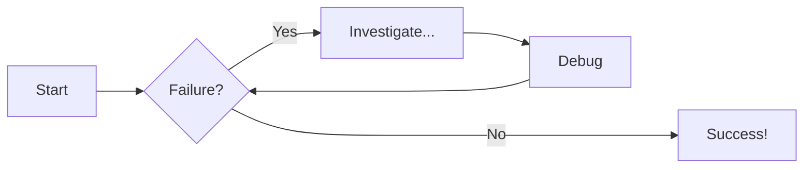
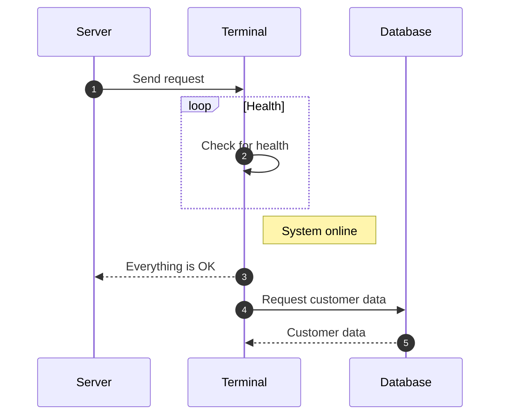

# Getting Started with Material for MkDocs 2024 Edition

Script for the getting started with Material for MkDocs tutorial - 2024 edition.

<!-- more -->

## Video Status

!!! info

    This is the script for the 2024 edition of the "Getting Started with Material for MkDocs" YouTube video.<br/><br/>
    **Current Status**: Reviewing Script<br/>
    **Last Updated**: 04-Sept-2024

## 1. Intro

!!! example "Section Metadata"

    **:material-video-box: Recording Type**: Narration

    **:material-text-box: Description**: Introduction to the video, outling the features we will add to our MkDocs Material website

    **:octicons-git-branch-16: Demo Branch**: `N/A`

- Welcome back to the channel! In today’s video we’re diving into Material for MkDocs, the ultimate framework for creating stunning, interactive documentation sites.
- In this tutorial, we’ll be creating a new documentation portal completely from scratch, and then hosting that on the web for free using GitHub pages.

??? tip "B-roll ideas"

    Animated screencasts or screenshots of the completed site showing all the features below

- Along the way, I’ll show you just a handful of the awesome features that Material for MkDocs comes bundled with, such as:

    - Setting a dynamic colour scheme
    - Adding a splash of personality with emojis, icons and logos to make your content visually appealing
    - How to create custom code blocks that adjust based on the programming language specified
    - How to better organise your content using Tabs
    - How to empathize parts of your content using admonitions - also known as callouts
    - And how to bring your ideas to life with statically rendered diagrams directly in your docs

- Now you can follow along with me directly in this video, or if you prefer I have a written version of this tutorial available on my [website](https://jameswillett.dev/getting-started-with-material-for-mkdocs-2024-edition/)

??? tip "B-roll ideas"

    Animated screencasts or screenshots this [tutorial](https://jameswillett.dev/getting-started-with-material-for-mkdocs-2024-edition/)

- I'll leave a link to the written tutorial in the description of this video.
- So if that sounds like something you'd be interested in, then breathe in, breathe out, and let’s explore this together 🙂

---

## 2. 'MkDocs' vs 'Material for MkDocs'

!!! example "Section Metadata"

    **:material-video-box: Recording Type**: Narration

    **:material-text-box: Description**: Highlight the differences between the Material theme for MkDocs, and the MkDocs tool itself

    **:octicons-git-branch-16: Demo Branch**: `N/A`

- Before we dive into the demo, let's go over the differences between [MkDocs](https://www.mkdocs.org/) and [Material for MkDocs](https://squidfunk.github.io/mkdocs-material/), as there is often some confusion.

??? tip "B-roll ideas"
    - MkDocs logo pops up on my left, Material on my right


- Plain **MkDocs** is a static site generator specifically designed for creating documentation websites. It works by converting Markdown files into a fully functional static site. With MkDocs, you get a straightforward setup, using a single YAML configuration file to manage your site.

??? tip "B-roll ideas"
    - Start with a screen recording showing a simple MkDocs site being generated from Markdown files.
    - Transition to a split-screen comparison: on one side, show the basic MkDocs site, and on the other, a site using Material for MkDocs with its enhanced design.

- On the other hand, **Material for MkDocs** is a theme built on top of MkDocs. It transforms your documentation site with a modern, responsive design inspired by Material Design principles. Now, what's important to note is that this theme doesn't just change the look; it enhances functionality with built-in plugins that support features like blog posts, social cards, advanced search capabilities and loads more.

- So basically, **MkDocs** provides the core functionality of building a static site, while **Material for MkDocs** signficantly elevates the visual and interactive experience of your documentation.

- Ok, now that's out of the way, let's get to work on setting up our new Material for MkDocs site.

---

## 2. Prereqs

!!! example "Section Metadata"

    **:material-video-box: Recording Type**: Narration

    **:material-text-box: Description**: Cover off the prerequisites that the user needs to have installed to follow along with the tutorial

    **:octicons-git-branch-16: Demo Branch**: `N/A`

- Before we begin, let’s go over the prerequistes you’ll need to have installed if you want to follow along with this tutorial

??? tip "B-roll ideas"
    Mac and Windows logos flash on screen

- Firstly, do be aware that i’ll be conducting this tutorial on a Mac. If you’re following on Windows then some of the commands we type into the terminal will be ever so slightly different… but I’ll try to call those out.

??? tip "B-roll ideas"
    List of these prereqs appear to left or right of me

- So we’re going to be using the __PYTHON__ version of MkDocs in this tutorial, and you’ll need to have PYTHON 3 installed. I’ll be using version `3.12.4` in this video, so either that or a later version should work fine.
- We’ll be using the Python package manager called PIP to install the required dependencies… but if you are running Python 3.4 or later then PIP is included anyway by default… otherwise if you’re using an earlier version, you might need to install PIP.
- Now, to follow along with the coding, it’s helpful if you have an IDE installed, and I’ll be using Visual Studio Code in this video.
- And finally, we’ll be publishing our documentation portal on GITHUB PAGES… so you’ll need to have an account on [GitHub](http://github.com) and ideally have git installed and setup to work from the command line as well.

And that’s all we should need. So let’s jump over to a terminal and get started!

---

## 3. Initial Installation

!!! example "Section Metadata"

    **:material-video-box: Recording Type**: Screencast

    **:material-text-box: Description**: In this section we go over creating the Python virtual environment and creating a vanilla MkDocs site

    **:octicons-git-branch-16: Demo Branch**: `1_InitialInstallation`

- Open a terminal in the folder that you want to create the project in
- Do `which python` to show my Python is aliased to `python3`
- Do `which python3` to show my Python is installed with Homebrew
    - Mention if you are running on Windows you can do **`where python` instead**
- Virtual environment setup with `python -m venv venv`
- `source venv/bin/activate` to activate virtual environment
- Check pip version `pip --version`
- Install mkdocs material - `pip install mkdocs-material`
- Open Visual studio code in this folder with `vscode .`
- Open a terminal within VS code and create the new site `mkdocs new .`
- Add basic `mkdocs.yml` configuration:

```yaml title="mkdocs.yml"
site_name: My MkDocs Material Documentation
site_url: https://sitename.example
theme:
  name: material
```

- Do `mkdocs serve` to launch the site
- Check the site at [http://localhost:8000](http://localhost:8000)

---

## 4. Add Yaml Schema Validation

!!! example "Section Metadata"

    **:material-video-box: Recording Type**: Screencast

    **:material-text-box: Description**: Add MkDocs Material Yaml Schema Validation

    **:octicons-git-branch-16: Demo Branch**: `N/A`

- Explain that to activate most of the useful features in MkDocs Material, we need to make a few changes to the `mkdocs.yml` file… making these changes is much easier with the help of YAML schema validation.
- Install the `Yaml` plugin within Extensions
    - Plugin can also be found on [Visual Studio Marketplace](https://marketplace.visualstudio.com/items?itemName=redhat.vscode-yaml)
- In VsCode open `settings.json`. You can open this by clicking on settings in the bottom left gear icon, then clicking the document icon in the top right.
- Add the following at the bottom:

```json title="settings.json"
  "yaml.schemas": {
    "https://squidfunk.github.io/mkdocs-material/schema.json": "mkdocs.yml"
  },
  "yaml.customTags": [
    "!ENV scalar",
    "!ENV sequence",
    "!relative scalar",
    "tag:yaml.org,2002:python/name:material.extensions.emoji.to_svg",
    "tag:yaml.org,2002:python/name:material.extensions.emoji.twemoji",
    "tag:yaml.org,2002:python/name:pymdownx.superfences.fence_code_format"
  ]
```

- Show the `mkdocs.yml` file and how we now get popups when we mouse over elements

---

## 5. Adjust Color Scheme

!!! example "Section Metadata"

    **:material-video-box: Recording Type**: Screencast

    **:material-text-box: Description**: Setup Light and Dark mode toggle within MkDocs, and change the colour scheme

    **:octicons-git-branch-16: Demo Branch**: `2_AdjustColor`


- Let's start making some changes to the style of our documentation, starting with the color scheme.
- I'll start by changing the color scheme to black. Add this to the `mkdocs.yml` file:

```yaml title="mkdocs.yml"
theme:
  name: material
  palette: 
    scheme: slate
```

- Change the primary colour to green by adding `primary: green` under the palette:

```yaml title="mkdocs.yml" hl_lines="5"
theme:
  name: material
  palette: 
    scheme: slate
    primary: green
```

- We can see that this makes the banner green, and also the hyperlinks green.
- Let's also change the accent colour to `deep purple`:

```yaml title="mkdocs.yml" hl_lines="6"
theme:
  name: material
  palette: 
    scheme: slate
    primary: green
    accent: deep purple
```

- Now when we hover over the links with the mouse, they turn purple.

- Another cool thing we can easily do in MkDocs is add a toggle to our site that allows the user to switch between light and dark modes. Add this to `palette` in the `mkdocs.yml` file to enable this:

```yaml title="mkdocs.yml"
theme:
  name: material
  palette:
    # Dark Mode
    - scheme: slate
      toggle:
        icon: material/weather-sunny
        name: Dark mode
      primary: green
      accent: deep purple

    # Light Mode
    - scheme: default
      toggle:
        icon: material/weather-night
        name: Light mode
      primary: blue
      accent: deep orange
```

- There are lots of other configuration options available to you in Material for MkDocs if you want to adjust the colour, for example adding custom colours or automatically switching between light and dark mode based on the time of day

??? tip "B-roll ideas"
    Scrolling screenshot of [colors documentation](https://squidfunk.github.io/mkdocs-material/setup/changing-the-colors/#custom-colors)

- For more information, check the [colors documentation page](https://squidfunk.github.io/mkdocs-material/setup/changing-the-colors/#custom-colors)

---

## 6. Adjust Font

!!! example "Section Metadata"

    **:material-video-box: Recording Type**: Screencast

    **:material-text-box: Description**: Change the font used on the MkDocs website

    **:octicons-git-branch-16: Demo Branch**: `3_AdjustFont`

- Let's see how we can change the font in our documentation.

??? tip "B-roll ideas"
    Scrolling screenshot of [Google Fonts](https://fonts.google.com/?query=Montserrat)

- Material for MkDocs supports any [Google font](https://fonts.google.com/?query=Montserrat) directly out of the box.

- Let's change the default font to `Merriweather Sans` :

```yaml title="mkdocs.yml" hl_lines="3"
theme:
  font:
    text: Merriweather Sans
```

- We can also change the font of the `code` in our docs:

```yaml title="mkdocs.yml" hl_lines="4"
theme:
  font:
    text: Merriweather Sans
    code: Red Hat Mono
```

??? tip "B-roll ideas"
    Scrolling screenshot of [fonts documentation](https://squidfunk.github.io/mkdocs-material/setup/changing-the-fonts/#customization)

- Now if you want to add additional fonts beyond Google fonts, or change other font configuration, do check the [Material font documentation](https://squidfunk.github.io/mkdocs-material/setup/changing-the-fonts/)

---

## 7. Reminder to Like and Subscribe 

!!! example "Section Metadata"

    **:material-video-box: Recording Type**: Narration

    **:material-text-box: Description**: remind viewers to like and subscribe to the channel

    **:octicons-git-branch-16: Demo Branch**: `N/A`

- Before we go on, if you’re finding this video helpful, please hit the like button down below, and subscribe to the channel for more videos just like this.
- OK. Let’s carry on setting up our MkDocs Material site!

---

## 8. Using Emojs

!!! example "Section Metadata"

    **:material-video-box: Recording Type**: Screencast

    **:material-text-box: Description**: Show how to configure Emojis and Icons and use them in the documentation

    **:octicons-git-branch-16: Demo Branch**: `4_Emojs`

- Another cool thing about Material for MkDocs is the possibility of using over 10,000 emojis and icons in your documentation, pretty much out of the box

??? tip "B-roll ideas"
    Screencast of searching for [Emojis](https://squidfunk.github.io/mkdocs-material/reference/icons-emojis/#search)

- If you head over to the [Material Emoji Documentation](https://squidfunk.github.io/mkdocs-material/reference/icons-emojis/#search), you can easily search through everything that is available.
- To add the ability to use these to your documentation portal, add this config to your `mkdocs.yml`:

```yaml title="mkdocs.yml"
markdown_extensions:
  - attr_list
  - pymdownx.emoji:
      emoji_index: !!python/name:material.extensions.emoji.twemoji
      emoji_generator: !!python/name:material.extensions.emoji.to_svg
```

- Then add a sentence to the `index.md` file with a couple of emojis

---

## 9. Logos and Icons

!!! example "Section Metadata"

    **:material-video-box: Recording Type**: Screencast

    **:material-text-box: Description**: Show how to change the logo and favicon of the site

    **:octicons-git-branch-16: Demo Branch**: `5_LogoAndIcons`

- Now that we have emojis and icons setup in our documentation, let's see how we can change the logo of our site.

### Icon for Logo
- Search for `solid-w` and find the fontawesome icon we want to use for the logo.
- Change the icon by making this change to the `mkdocs.yml`

```yaml title="mkdocs.yml"
theme:
  icon:
    logo: fontawesome/solid/w
```

### Image for Logo
- Mention how we could also change the logo to an image if we prefer.
- Inside the `docs` folder create an `assets` folder.
- Add the `logo.png`, which is our site logo that I generated earlier.
- Now change `mkdocs.yml` to:

```yaml title="mkdocs.yml"
theme:
  logo: assets/logo.png
```

### Change Favicon
- Let's change the favicon as well.
- First i'll add the `favicon.ico` file to the `assets` folder we just created.
- Then adjust `mkdocs.yml` to:

```yaml title="mkdocs.yml"
theme:
  favicon: assets/favicon.ico
```

??? tip "B-roll ideas"
    Screencast of [icon and logos documentation](https://squidfunk.github.io/mkdocs-material/setup/changing-the-logo-and-icons/)

- You can change other icons on your MkDocs Material site in a similar way, but if you want to know more check the [Material Logo and Icons Documentation](https://squidfunk.github.io/mkdocs-material/setup/changing-the-logo-and-icons/)

---

## 10. Code Blocks

!!! example "Section Metadata"

- One of the best features of Material for MkDocs is it's ability to display code in a clear, crisp and distinctive manner.
- Let's create a new page in our documentation called `code-examples.md`
- And add in the following example Python code:

```py title="code-examples.md"
# Function to add two numbers
def add_two_numbers(num1, num2):
    return num1 + num2

# Example usage
result = add_two_numbers(5, 3)
print('The sum is:', result)
```

- Show the viewer the code in the browser - it looks OK but not colouring, let's change that next
- We need to add some extra configuration to our `mkdocs.yml`:

```yaml title="mkdocs.yml"
markdown_extensions:
  - pymdownx.highlight:
      anchor_linenums: true
      line_spans: __span
      pygments_lang_class: true
  - pymdownx.inlinehilite
  - pymdownx.snippets
  - pymdownx.superfences
```

- Now go back and show the code is nicely highlighted
- Mention that if you want to use another language find the lexers (short names for the language) on this [pygments](https://pygments.org/docs/lexers/#lexers-for-javascript-and-related-languages) page
    - e.g. [typescript](https://pygments.org/docs/lexers/#pygments.lexers.javascript.TypeScriptLexer)

### Add Title

- Add a title to the codeblock by doing `py title="add_numbers.py"`

### Add Line Numbers

- Add line numbers by doing `py linenums="1"`
- Also show the line numbers can start from a different number

### Highlight Lines

- To highlight lines do `py hl_lines="2-4"`
- Use another codeblock to show this:

```js title="code-examples.md" linenums="1" hl_lines="2-4"
// Function to concatenate two strings
function concatenateStrings(str1, str2) {
  return str1 + str2;
}

// Example usage
const result = concatenateStrings("Hello, ", "World!");
console.log("The concatenated string is:", result);
```

--- 

## 11. Content Tabs

!!! example "Section Metadata"

    **:material-video-box: Recording Type**: Screencast

    **:material-text-box: Description**: Show some examples of how to use content tabs

    **:octicons-git-branch-16: Demo Branch**: `7_ContentTabs`

- Talk briefly about when content tabs would be useful, e.g. for different code examples
- To enable them, add this configuration to `mkdocs.yml`:

```yaml title="mkdocs.yml"
markdown_extensions:
  - pymdownx.superfences
  - pymdownx.tabbed:
      alternate_style: true
```

- Create a new page called `content-tabs.md`
- Add the following to show `generic` content tabs:

```
## Content Tabs

This is some examples of content tabs.

### Generic Content

=== "Plain text"

    This is some plain text

=== "Unordered list"

    * First item
    * Second item
    * Third item

=== "Ordered list"

    1. First item
    2. Second item
    3. Third item
```

- Then show how we can use content tabs with code blocks, with this:

```
### Code Blocks in Content Tabs

=== "Python"

    ```py
    def main():
        print("Hello world!")

    if __name__ == "__main__":
        main()
    ```

=== "JavaScript"

    ```js
    function main() {
        console.log("Hello world!");
    }

    main();
    ```
```

---

## 12. Admonitions (aka Callouts)

!!! example "Section Metadata"

    **:material-video-box: Recording Type**: Screencast

    **:material-text-box: Description**: Show some examples of how to use admonitions

    **:octicons-git-branch-16: Demo Branch**: `8_Admonitions`

- Admonitions - also known as callouts - are great for highlighting parts of the documentation.
- Add this configuration to `mkdocs.yml`:

```yaml title="mkdocs.yml"
markdown_extensions:
  - admonition
  - pymdownx.details
  - pymdownx.superfences
```
- Create a new page called `admonitions.md`
- Show this example admonition with a title:

```
!!! note "Title of the callout"

    Lorem ipsum dolor sit amet, consectetur adipiscing elit. Nulla et euismod
    nulla. Curabitur feugiat, tortor non consequat finibus, justo purus auctor
    massa, nec semper lorem quam in massa.
```

- Show a collapisble admonition:

```
Collapsible callout:

??? info "Collapsible callout"

    Lorem ipsum dolor sit amet, consectetur adipiscing elit. Nulla et euismod
    nulla. Curabitur feugiat, tortor non consequat finibus, justo purus auctor
    massa, nec semper lorem quam in massa.
```

- Briefly talk through the other examples shown on the [Admonitions documentation]( https://squidfunk.github.io/mkdocs-material/reference/admonitions/#supported-types)

---

## 13. Diagrams

!!! example "Section Metadata"

    **:material-video-box: Recording Type**: Screencast

    **:material-text-box: Description**: Show some examples of how to use diagrams

    **:octicons-git-branch-16: Demo Branch**: `9_Diagrams`

- Talk about use cases for diagrams such as flow charts, sequence diagrams, state diagrams

??? tip "B-roll ideas"
    Screencast of [diagrams documentation](https://squidfunk.github.io/mkdocs-material/reference/diagrams/)

- Add configuration to `mkdocs.yml`:

```yaml title="mkdocs.yml"
markdown_extensions:
  - pymdownx.superfences:
      custom_fences:
        - name: mermaid
          class: mermaid
          format: !!python/name:pymdownx.superfences.fence_code_format
```

- Create a new page called `diagram-examples.md`
- Add a flowchart example:

```
# Diagram Examples

## Flowcharts



- Add a sequence diagram:

```
## Sequence Diagrams



- Mention other examples of diagrams and show the [diagrams documentation](https://squidfunk.github.io/mkdocs-material/reference/diagrams/#using-state-diagrams)


---

## 14. Footer

!!! example "Section Metadata"

    **:material-video-box: Recording Type**: Screencast

    **:material-text-box: Description**: Demonstrate how to add the footer and configure it

    **:octicons-git-branch-16: Demo Branch**: `10_Footer`

- Enable the navigation footer in `mkdocs.yml`:

```yaml title="mkdocs.yml"
theme:
  features:
    - navigation.footer
```

- Add the social icons to the footer:

```yaml title="mkdocs.yml"
extra:
  social:
    - icon: simple/youtube
      link: https://youtube.com/@james-willett
    - icon: simple/linkedin
      link: https://linkedin.com/in/willettjames
```

- Add the copyright notice:

```yaml title="mkdocs.yml"
copyright: Copyright &copy; 2024 James Willett
```

---

## 15. Publish site to GitHub Pages

!!! example "Section Metadata"

    **:material-video-box: Recording Type**: Screencast

    **:material-text-box: Description**: Show how to push the documentation to a GitHub repo then publish it on GitHub pages

    **:octicons-git-branch-16: Demo Branch**: `11_Publish`

- Create the `.github/workflows/ci.yml` file and paste in the example code:

```yaml title=".github/workflows/ci.yml"
name: ci 
on:
  push:
    branches:
      - master 
      - main
permissions:
  contents: write
jobs:
  deploy:
    runs-on: ubuntu-latest
    steps:
      - uses: actions/checkout@v4
      - name: Configure Git Credentials
        run: |
          git config user.name github-actions[bot]
          git config user.email 41898282+github-actions[bot]@users.noreply.github.com
      - uses: actions/setup-python@v5
        with:
          python-version: 3.x
      - run: echo "cache_id=$(date --utc '+%V')" >> $GITHUB_ENV 
      - uses: actions/cache@v4
        with:
          key: mkdocs-material-${{ env.cache_id }}
          path: .cache
          restore-keys: |
            mkdocs-material-
      - run: pip install mkdocs-material 
      - run: mkdocs gh-deploy --force
```

- Create a brand new GitHub repository
- Hook up that GitHub repository remote with the project code (i.e. do `git init` then follow instructions to add the remote)
- Push branch to `main` on the GitHub repository
- Go to GitHub and into settings and change **PAGES** to `deploy from branch` and choose the `gh-pages` branch.
- Show GitHub Action running that deploys the site
- Show documentation is deployed and accessible

---

## 16. Outro

!!! example "Section Metadata"

    **:material-video-box: Recording Type**: Narration

    **:material-text-box: Description**: Summary of the video and where to go next

    **:octicons-git-branch-16: Demo Branch**: `N/A`

- In this video we've seen how to create and deploy an entire Material for MkDocs documentation website completely from scratch, and taken a look at just a few of the awesome features that Material for MkDocs ships with.

??? tip "B-roll ideas"
    Screencast of [MkDocs Material documentation](https://squidfunk.github.io/mkdocs-material/getting-started/)

- We've only really scratched the surface of what Material offers in this video... so to learn more about the many other features that are on offer, do check out the [official documentation](https://squidfunk.github.io/mkdocs-material/getting-started/)

- But what about you? Are you using Material for MkDocs? What other features would you like to see covered? Let me know in the comments down below, I'd love to hear from you.
- But that's all for this video, I'll see you in the next one. 