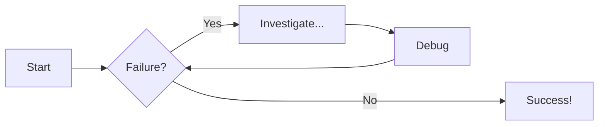
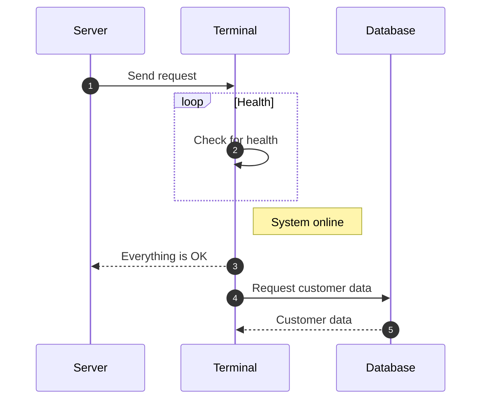

# Getting Started with Material for MkDocs

Supporting blog post for my **Material for MkDocs: Full Tutorial To Build And Deploy Your Docs Portal** video on [:simple-youtube: YouTube](https://www.youtube.com/watch?v=xlABhbnNrfI){:target="\_blank"}.

[![YouTube Thumbnail Material MkDocs]](./material-mkdocs-getting-started-2024.md)

[YouTube Thumbnail Material MkDocs]: material-mkdocs-getting-started-2024/MkDocs2024_Thumbnail2.jpg

<!-- more -->

## Introduction

[Material for MkDocs](https://squidfunk.github.io/mkdocs-material/) is the ultimate framework for creating stunning, interactive documentation sites. In this tutorial, we’ll be creating a new documentation portal completely from scratch, and then hosting that on the web for free using [GitHub pages](https://pages.github.com/).

Along the way, you'll learn just a handful of the awesome features that Material for MkDocs comes bundled with, such as:

- Setting a **dynamic colour scheme**
- Adding a splash of personality with **emojis**, **icons** and **logos** to make your content visually appealing
- How to create **custom code blocks** that adjust based on the programming language specified
- How to better organise your documentation using **content tabs**
- How to empathize parts of your content using **admonitions** - also known as _callouts_
- And how to bring your ideas to life with **statically rendered diagrams** directly in your docs

???+ tip 
    This is an in-depth tutorial. If this is your first time using Material for MkDocs then you're probably best to just follow it all through from the beginning.

    But if you've used Material for MkDocs before and just want to know about a certain feature, you can use the __Table of contents__ on the right to jump around this guide at your leisure.

!!! info "Supporting GitHub Repository"
    I've created a supporting [GitHub repository](https://github.com/james-willett/material-mkdocs-youtube-2024){:target="\_blank"} for all the code examples featured in this tutorial

---

## 'MkDocs' vs 'Material for MkDocs'

Before we begin the tutorial, let's quickly go over the differences between [MkDocs](https://www.mkdocs.org/) and [Material for MkDocs](https://squidfunk.github.io/mkdocs-material/), as there is often some confusion.

Plain [**MkDocs**](https://www.mkdocs.org/) is a static site generator specifically designed for creating documentation websites. So by using MkDocs alone, you get a relatively vanilla and straightforward site for your documentation.

On the other hand, [**Material for MkDocs**](https://squidfunk.github.io/mkdocs-material/) is a theme built on top of MkDocs. It transforms your documentation site with a modern, responsive design inspired by Material Design principles. 

What's important to note is that this theme doesn't just change the look; it enhances functionality with built-in plugins that support features like:

- [Blog posts](https://squidfunk.github.io/mkdocs-material/setup/setting-up-a-blog/) 
- [Social cards](https://squidfunk.github.io/mkdocs-material/setup/setting-up-social-cards/)
- [Advanced search capabilities](https://squidfunk.github.io/mkdocs-material/setup/setting-up-site-search/) 
- and lots more...

!!! info
    So to summarise, **MkDocs** provides the core functionality of building a static site, while **Material for MkDocs** signficantly elevates the visual and interactive experience of your documentation.

Now that we understand the differences, let's get to work on setting up our new **Material for MkDocs** portal.

---

## Prerequisites

These are the _prerequistes_ you’ll need to have installed if you want to follow along with this tutorial:

- [:simple-python: Python](https://www.python.org/downloads/)
    - [pip](https://pip.pypa.io/en/stable/installation/) - the Python package manager (included by default in Python 3.4 and later)
- [:material-microsoft-visual-studio-code: Visual Studio Code](https://code.visualstudio.com/) - or any other IDE of your choice
- [:simple-github: GitHub Account](http://github.com) - as we will deploy the site on [GitHub pages](https://pages.github.com/)


---

## Initial Installation

- Open a terminal in the folder that you want to create the project in
- Type `which python` or `which python3` to check Python is installed
??? note "To check Python location on :material-microsoft-windows: Windows"
    Type `where python` instead on the command prompt or Powershell terminal
- Setup a [Python virtual environment](https://realpython.com/what-is-pip/#using-pip-in-a-python-virtual-environment) by typing `python -m venv venv`
- Type `source venv/bin/activate` to activate the virtual environment
??? note "To activate Python virtual environment on :material-microsoft-windows: Windows"
    Type `.\venv\Scripts\activate` instead
- Check pip version `pip --version`
- Install mkdocs material - `pip install mkdocs-material`
- Open Visual studio code in this folder with `code .`
- Open a terminal within Visual Studio code
- Activate the virtual environment on the new terminal with `source venv/bin/activate`
- Create a new site `mkdocs new .`
- Add the following basic `mkdocs.yml` configuration:

```yaml title="mkdocs.yml"
site_name: My MkDocs Material Documentation
site_url: https://sitename.example
theme:
  name: material
```

- Type `mkdocs serve` to launch the site
- Check the site at [http://localhost:8000](http://localhost:8000)

---

## Add Yaml Schema Validation

To activate most of the useful features in MkDocs Material, we need to make changes to the `mkdocs.yml` file. Making these changes is much easier with the help of [YAML schema validation](https://squidfunk.github.io/mkdocs-material/schema.json).

- Within the **Extensions** tab of Visual Studio Code, install the [Red Hat VS Code Yaml](https://marketplace.visualstudio.com/items?itemName=redhat.vscode-yaml) extension.
- In VsCode open `settings.json`. 

???+ tip "How to open `settings.json` in :material-microsoft-visual-studio-code: Visual Studio Code"
    You can open `settings.json` by clicking the :gear: **gear** icon in the bottom left, then clicking the :page_facing_up: **document** icon in the top right.
- Add the following at the bottom of the `settings.json` file:

```json title="settings.json"
  "yaml.schemas": {
    "https://squidfunk.github.io/mkdocs-material/schema.json": "mkdocs.yml"
  },
  "yaml.customTags": [
    "!ENV scalar",
    "!ENV sequence",
    "!relative scalar",
    "tag:yaml.org,2002:python/name:material.extensions.emoji.to_svg",
    "tag:yaml.org,2002:python/name:material.extensions.emoji.twemoji",
    "tag:yaml.org,2002:python/name:pymdownx.superfences.fence_code_format"
  ]
```

Now when you mouse-over any of the entries in the `mkdocs.yml` file, you'll see a popup with more information about that entry. Any errors in the yaml file will also be highlighted.

---

## Adjust Color Scheme

We can easily change the color scheme of our documentation.

### Switch to Dark Mode

Start by changing the color scheme to :black_circle: **dark**. Add this to the `mkdocs.yml` file:

```yaml title="mkdocs.yml"
theme:
  name: material
  palette:
    scheme: slate
```

### Primary Colour

Let's also change the **primary colour** in our documentation to :green_circle: **green** by adding `primary: green` under the palette:

```yaml title="mkdocs.yml" hl_lines="5"
theme:
  name: material
  palette:
    scheme: slate
    primary: green
```

We can see that this makes the banner green, and also the hyperlinks green.

### Accent Colour

Let's also change the accent colour to :purple_circle: **`deep purple`** :

```yaml title="mkdocs.yml" hl_lines="6"
theme:
  name: material
  palette:
    scheme: slate
    primary: green
    accent: deep purple
```

Now when we hover over the links with the mouse, they turn purple.

### Toggle Light/Dark Modes

We can also add a toggle to our site that allows the user to switch between :white_circle: **light** and :black_circle: **dark** modes. Add this to `palette` in the `mkdocs.yml` file to enable this:

```yaml title="mkdocs.yml"
theme:
  name: material
  palette:
    # Dark Mode
    - scheme: slate
      toggle:
        icon: material/weather-sunny
        name: Dark mode
      primary: green
      accent: deep purple

    # Light Mode
    - scheme: default
      toggle:
        icon: material/weather-night
        name: Light mode
      primary: blue
      accent: deep orange
```

There are lots of other configuration options available to you in Material for MkDocs if you want to adjust the colour, for example adding [**custom colours**](https://squidfunk.github.io/mkdocs-material/setup/changing-the-colors/#custom-colors) or [**automatically switching between light and dark mode**](https://squidfunk.github.io/mkdocs-material/setup/changing-the-colors/#automatic-light-dark-mode) based on the time of day.

For more information, check the [colors documentation page](https://squidfunk.github.io/mkdocs-material/setup/changing-the-colors/#custom-colors).

---

## Adjust Font

Material for MkDocs supports any [Google font](https://fonts.google.com/?query=Montserrat) directly out of the box.

### Default Font

Let's change the default font to `Merriweather Sans`:

```yaml title="mkdocs.yml" hl_lines="3"
theme:
  font:
    text: Merriweather Sans
```

### Code Font

We can also change the font of the `code` in our docs:

```yaml title="mkdocs.yml" hl_lines="4"
theme:
  font:
    text: Merriweather Sans
    code: Red Hat Mono
```

If you want to add additional fonts beyond Google fonts, or change other font configuration, do check the [Material font documentation](https://squidfunk.github.io/mkdocs-material/setup/changing-the-fonts/)

---

## Emojs

Material for MkDocs offers the possibility of using over **10,000 emojis and icons** in your documentation with minimal configuration.

Browse through all available emojis and icons on the [Material Emoji Documentation](https://squidfunk.github.io/mkdocs-material/reference/icons-emojis/#search).

To add the ability to use these to your documentation portal, add this config to your `mkdocs.yml`:

```yaml title="mkdocs.yml"
markdown_extensions:
  - attr_list
  - pymdownx.emoji:
      emoji_index: !!python/name:material.extensions.emoji.twemoji
      emoji_generator: !!python/name:material.extensions.emoji.to_svg
```

Then simply add a sentence to any of your documentation files (e.g.`index.md`) with the emoji or icon code.

---

## Logos and Icons

Now that we have emojis and icons setup in our documentation, we can easily change the logo of our site.

### Setting Logo to an Icon

[Search](https://squidfunk.github.io/mkdocs-material/reference/icons-emojis/) for a suitable icon for your logo (for example `solid-w`).

Change the icon by making this change to the `mkdocs.yml`

```yaml title="mkdocs.yml"
theme:
  icon:
    logo: fontawesome/solid/w
```

### Setting Logo to an Image

If you would prefer to set the logo of your site to your own custom image, follow these steps:

- Inside the `docs` folder create an `assets` folder.
- Add the `logo.png` file to this folder (i.e. the file with the logo you want to use)
- Now change `mkdocs.yml` to:

```yaml title="mkdocs.yml"
theme:
  logo: assets/logo.png
```

### Setting the Favicon

We can also set the Favicon for our site in a similar way:

- First add the `favicon.ico` file to the `assets` folder we just created.
- Then adjust `mkdocs.yml` to:

```yaml title="mkdocs.yml"
theme:
  favicon: assets/favicon.ico
```

You can change other icons on your MkDocs Material site in a similar way, but if you want to know more check the [Material Logo and Icons Documentation](https://squidfunk.github.io/mkdocs-material/setup/changing-the-logo-and-icons/).

---

## Code Blocks

One of the best features of Material for MkDocs is it's ability to [display code](https://squidfunk.github.io/mkdocs-material/reference/code-blocks/) in a clear, crisp and distinctive manner.

- Create a new page in your documentation called `code-examples.md`.
- Add the following example :simple-python: Python code:

```py title="code-examples.md"
# Function to add two numbers
def add_two_numbers(num1, num2):
    return num1 + num2

# Example usage
result = add_two_numbers(5, 3)
print('The sum is:', result)
```

The code will display in a code block in the documentation portal, but won't have syntax colouring. To enable syntax colouring, add this extra configuration to our `mkdocs.yml`:

```yaml title="mkdocs.yml"
markdown_extensions:
  - pymdownx.highlight:
      anchor_linenums: true
      line_spans: __span
      pygments_lang_class: true
  - pymdownx.inlinehilite
  - pymdownx.snippets
  - pymdownx.superfences
```

The previous code block we added will now be nicely highlighted.

If you want to add code in another language, find the lexers (short names for the language) on this [pygments](https://pygments.org/docs/lexers/#lexers-for-javascript-and-related-languages) page. For example:

- [:simple-typescript: Typescript](https://pygments.org/docs/lexers/#pygments.lexers.javascript.TypeScriptLexer)
- [:fontawesome-brands-java: Java](https://pygments.org/docs/lexers/#pygments-lexers-for-jvm-languages)
- [:fontawesome-brands-golang: GoLang](https://pygments.org/docs/lexers/#lexers-for-the-google-go-language)

### Add Title

- Add a title to the codeblock by typing `py title="add_numbers.py"`:

````markdown title="Code block with title"
```py title="add_numbers.py" 
# Function to add two numbers
def add_two_numbers(num1, num2):
    return num1 + num2

# Example usage
result = add_two_numbers(5, 3)
print('The sum is:', result)
```
````

<div class="result" markdown>
```py title="code_examples.md" 
# Function to add two numbers
def add_two_numbers(num1, num2):
    return num1 + num2

# Example usage
result = add_two_numbers(5, 3)
print('The sum is:', result)
```
</div>

### Add Line Numbers

Add line numbers by typing `py linenums="1"`:

````markdown title="Code block with line numbers"
```py title="add_numbers.py" linenums="1"
# Function to add two numbers
def add_two_numbers(num1, num2):
    return num1 + num2

# Example usage
result = add_two_numbers(5, 3)
print('The sum is:', result)
```
````

<div class="result" markdown>
```py title="code_examples.md" linenums="1"
# Function to add two numbers
def add_two_numbers(num1, num2):
    return num1 + num2

# Example usage
result = add_two_numbers(5, 3)
print('The sum is:', result)
```
</div>

You can also start the line numbers from a different number e.g. `py linenums="5"`

### Highlight Lines

To highlight lines type `py hl_lines="2-4"`. 

Here is another codeblock to show this:

````markdown title="Highlight Lines"
```js title="code-examples.md" linenums="1" hl_lines="2-4"
// Function to concatenate two strings
function concatenateStrings(str1, str2) {
  return str1 + str2;
}

// Example usage
const result = concatenateStrings("Hello, ", "World!");
console.log("The concatenated string is:", result);
```
````

<div class="result" markdown>
```js title="code-examples.md" linenums="1" hl_lines="2-4"
// Function to concatenate two strings
function concatenateStrings(str1, str2) {
  return str1 + str2;
}

// Example usage
const result = concatenateStrings("Hello, ", "World!");
console.log("The concatenated string is:", result);
```
</div>

---

## Content Tabs

Content tabs are useful when you want to group alternative content together. To enable content tabs add the following to the `mkdocs.yml` file:

```yaml title="mkdocs.yml"
markdown_extensions:
  - pymdownx.superfences
  - pymdownx.tabbed:
      alternate_style: true
```

- Create a new page called `content-tabs.md`
- Add the following to show `generic` content tabs:

```markdown title="content-tabs.md"
## Content Tabs

This is some examples of content tabs.

### Generic Content

=== "Plain text"

    This is some plain text

=== "Unordered list"

    * First item
    * Second item
    * Third item

=== "Ordered list"

    1. First item
    2. Second item
    3. Third item
```

Here is an example with different code blocks:

````markdown title="content-tabs.md"
### Code Blocks in Content Tabs

=== "Python"

    ```py
    def main():
        print("Hello world!")

    if __name__ == "__main__":
        main()
    ```

=== "JavaScript"

    ```js
    function main() {
        console.log("Hello world!");
    }

    main();
    ```
````

---

## Admonitions (aka Callouts)

Admonitions - also known as callouts - are great for highlighting parts of the documentation.

To enable them, add this configuration to the `mkdocs.yml`:

```yaml title="mkdocs.yml"
markdown_extensions:
  - admonition
  - pymdownx.details
  - pymdownx.superfences
```

- Create a new page called `admonitions.md`
- This is an example of an adominition with a title:

```
!!! note "Title of the callout"

    Lorem ipsum dolor sit amet, consectetur adipiscing elit. Nulla et euismod
    nulla. Curabitur feugiat, tortor non consequat finibus, justo purus auctor
    massa, nec semper lorem quam in massa.
```
!!! note "Title of the callout"

    Lorem ipsum dolor sit amet, consectetur adipiscing elit. Nulla et euismod
    nulla. Curabitur feugiat, tortor non consequat finibus, justo purus auctor
    massa, nec semper lorem quam in massa.

### Collapsible Admonitions

You can also have a collapisble admonition:

```
Collapsible callout:

??? info "Collapsible callout"

    Lorem ipsum dolor sit amet, consectetur adipiscing elit. Nulla et euismod
    nulla. Curabitur feugiat, tortor non consequat finibus, justo purus auctor
    massa, nec semper lorem quam in massa.
```
??? info "Collapsible callout"

    Lorem ipsum dolor sit amet, consectetur adipiscing elit. Nulla et euismod
    nulla. Curabitur feugiat, tortor non consequat finibus, justo purus auctor
    massa, nec semper lorem quam in massa.

Check the [Admonitions documentation](https://squidfunk.github.io/mkdocs-material/reference/admonitions/#supported-types) for other examples of admonitions you can use.

---

## Diagrams

Material for MkDocs allows you to easily implement statically rendered diagrams in your documentation. Examples of diagrams you might include are:

- [Flow charts](https://squidfunk.github.io/mkdocs-material/reference/diagrams/#using-flowcharts)
- [Sequence diagrams](https://squidfunk.github.io/mkdocs-material/reference/diagrams/#using-sequence-diagrams)
- [State diagrams](https://squidfunk.github.io/mkdocs-material/reference/diagrams/#using-state-diagrams)
- [Class diagrams](https://squidfunk.github.io/mkdocs-material/reference/diagrams/#using-class-diagrams)
- [Entity-relationship diagrams](https://squidfunk.github.io/mkdocs-material/reference/diagrams/#using-entity-relationship-diagrams)

To enable diagrams add this configuration to the `mkdocs.yml`:

```yaml title="mkdocs.yml"
markdown_extensions:
  - pymdownx.superfences:
      custom_fences:
        - name: mermaid
          class: mermaid
          format: !!python/name:pymdownx.superfences.fence_code_format
```

- Create a new page called `diagram-examples.md`
- Here is a **flowchart** example:

````markdown title="diagram-examples.md"
# Diagram Examples

## Flowcharts


````


- This is a **sequence diagram** example:

````markdown title="diagram-examples.md"
## Sequence Diagrams


````


Remember to check the [diagrams documentation](https://squidfunk.github.io/mkdocs-material/reference/diagrams/#using-state-diagrams) for further diagram examples.

---

## Footer

We can enable the navigation footer by adding the following to the `mkdocs.yml`:

```yaml title="mkdocs.yml"
theme:
  features:
    - navigation.footer
```

You might want to add social icons to your footer like this:

```yaml title="mkdocs.yml"
extra:
  social:
    - icon: simple/youtube
      link: https://youtube.com/@james-willett
    - icon: simple/linkedin
      link: https://linkedin.com/in/willettjames
```

And you can add the copyright notice:

```yaml title="mkdocs.yml"
copyright: Copyright &copy; 2024 James Willett
```

---

## Publish site to GitHub Pages

In order to publish our site on [GitHub Pages](https://pages.github.com/), first create the `.github/workflows/ci.yml` file and paste in the example code:

```yaml title=".github/workflows/ci.yml"
name: ci
on:
  push:
    branches:
      - master
      - main
permissions:
  contents: write
jobs:
  deploy:
    runs-on: ubuntu-latest
    steps:
      - uses: actions/checkout@v4
      - name: Configure Git Credentials
        run: |
          git config user.name github-actions[bot]
          git config user.email 41898282+github-actions[bot]@users.noreply.github.com
      - uses: actions/setup-python@v5
        with:
          python-version: 3.x
      - run: echo "cache_id=$(date --utc '+%V')" >> $GITHUB_ENV
      - uses: actions/cache@v4
        with:
          key: mkdocs-material-${{ env.cache_id }}
          path: .cache
          restore-keys: |
            mkdocs-material-
      - run: pip install mkdocs-material
      - run: mkdocs gh-deploy --force
```

- Create a brand new GitHub repository
- Hook up that GitHub repository remote with the project code (i.e. do `git init` then follow instructions to add the remote)
- Push branch to `main` on the GitHub repository
- Go to GitHub and into settings and change __pages__ to `deploy from branch`, choose the `gh-pages` branch.
- A GitHub Action will trigger that deploys the site
    - For example [https://james-willett.github.io/mkdocs-material-tutorial-2024/](https://james-willett.github.io/mkdocs-material-tutorial-2024/)