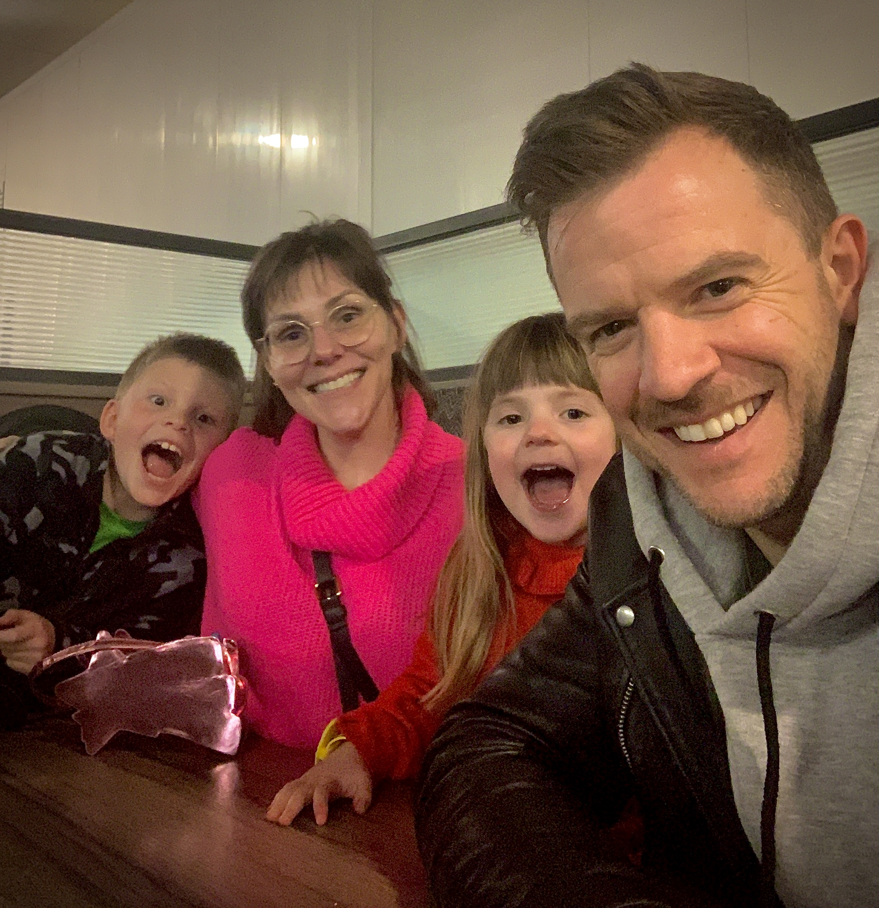

# Now

My **"What I'm Doing Now"** declaration page - last updated on **Sunday April 9th, 2023**.

[![Now - Banner Image]](./now.md)

  [Now - Banner Image]: now/Now_Banner.png

<!-- more -->

I’m in a town called Reading, just outside London in the UK. 

I'm working full-time as a Principal Software Engineer at SAP. I'm also trying to lead a balanced yet exciting and stable habit-based life with my wife Sarah and our two children Seb & Chloe.

---

## :construction_worker_tone1: My Current Projects :construction_worker_tone1:

This is what I spend my time doing:

- Being a supportive and present husband, father, son and friend
- Working mostly remotely in my role as a Principal Software Engineer at [SAP](https://sap.com)
- Creating in-depth, artful videos that help others become better software developers
- Producing online training courses that teach software development concepts and tools
- Delivering relevant content creation and software development advice through short/medium form content on social media
- Sending out a weekly newsletter with insights to my course creation processes
- Supporting my children with their schooling and other ongoing activities

---

## :white_check_mark: My Current Priorities :white_check_mark:

On a more global level, these are my **priorities**:

- Spend ample time building and maintaining deep relationships :speech_left:
- Have time to pursue learning projects and things that interest me :teacher:
- Walking 5 miles per day :man_walking:
- Lifting weights x3 per week :man_lifting_weights:
- Eating a healthy diet :broccoli:
- Sleep 7 hours a night :sleeping_accommodation:
- Delegate the things I don’t want to do/shouldn’t be doing :person_shrugging:
- Increase the proportion of my income that comes from my own products :money_with_wings:

---

I am open to considering new opportunities, as I highly value novelty, spontaneity, and growth. However, I aspire to stick to my priorities 90% of the time. As a result, I will say no to the majority of requests that come my way now.

If my activities or priorities happen to change, I’ll update this page to reflect those changes. Last update was **Sunday April 9th, 2023**.

This page is a public declaration and a reminder to myself, and it balances out the goal-driven nature of my Impossible List.

It was inspired by [Thomas Frank](https://thomasjfrank.com/) and [Derek Shivers](https://nownownow.com/about)

