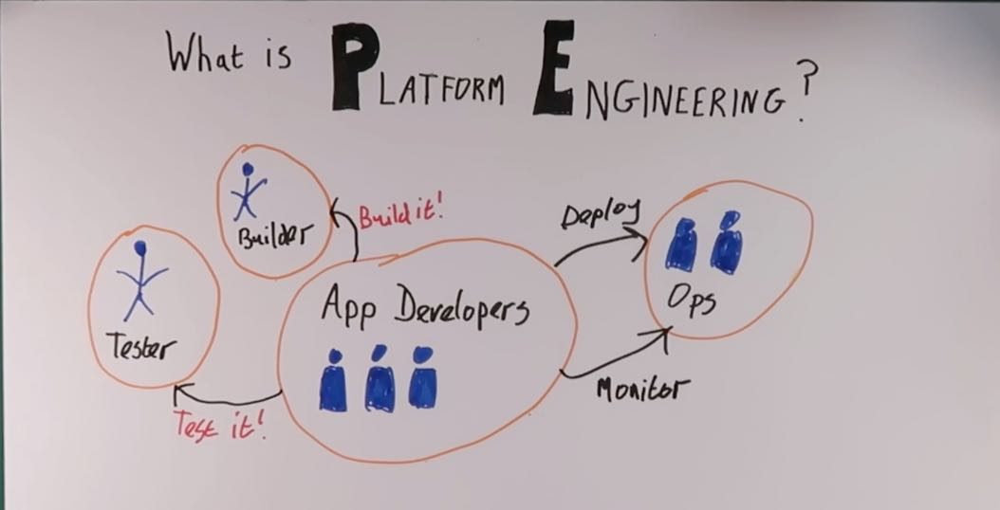
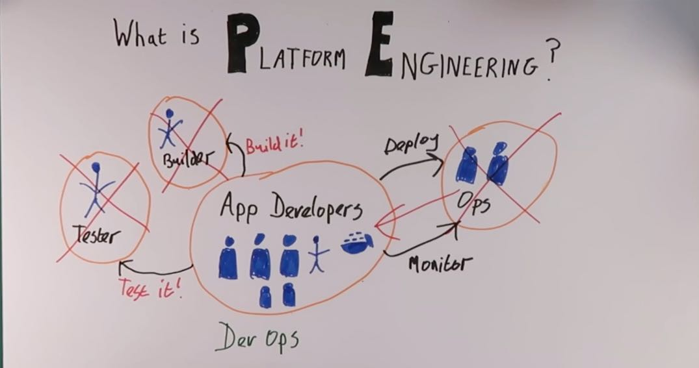
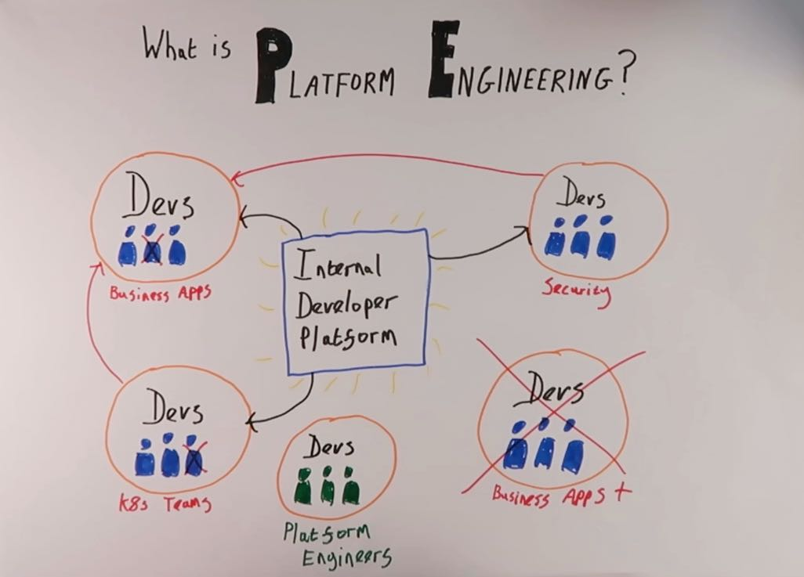

# Platform Engineering Explained

In this post we will explore what Platform Engineering is, and how it relates to 
modern software development.

<!-- more -->

## YouTube Video

This blog post has an accompanying [YouTube video](https://youtube.com) that you may prefer to view 
instead of reading this post (or watch alongside!).

[![YouTube Thumbnail]](https://youtube.com){:target="_blank"}

  [YouTube Thumbnail]: platform-engineering-explained/PlatformEngThumbnail.jpg

## What is Platform Engineering?

**Platform Engineering** essentially boils down to the *process of building tools, frameworks and processes that get consumed by software development teams* **internally** within an organization. 

By providing these artifacts and configurations to consuming teams (through an [Internal Developer Platform](https://internaldeveloperplatform.org/){:target="_blank"}), the idea is that they’ll become more self-sufficient.

If that doesn’t make much sense, then don’t panic. We’re going to explain it clearly below! :sunglasses:

The easiest way to explain **Platform Engineering** is to go back in time a bit, to around the early 2000s, before Agile became such a widely used term in the software development world.

## Software Development Before Agile

In the pre-Agile days of software development (i.e. the [Waterfall model](https://en.wikipedia.org/wiki/Waterfall_model){:target="_blank"}), a typical development team would basically have a bunch of developers writing application code.

Once the code was written, the team would throw the application over to the software testers (who lived *independently* from the team) for them to test.

When the code was ready to be built (and remember, this is before the era of :simple-docker:{ .docker } [Docker](https://www.docker.com/){:target="_blank"} :simple-docker:{ .docker } and [containerisation](https://www.checkpoint.com/cyber-hub/cloud-security/what-is-container-security/what-is-containerization/#:~:text=Containerization%20is%20a%20type%20of,and%20highly%20conducive%20to%20automation.){:target="_blank"}), they’d send the app code to another team and have them build it.

Now the code is ready to run in production, so the developer team send it over to an **Ops** team. This team would take care of deploying it in production, running it and monitoring it.

<figure markdown>
  
  <figcaption> Software Engineering Before Agile
</figure>

Whilst you could argue this was a much simpler time in software development, it was massively inefficient. Having testers outside the team for example, bugs would often only be found deep in the development cycle, and take longer to resolve.

Everything was slow, and development of new applications and features crawled at a snail's pace. :snail:

## Agile and "Shift-Left"

So now along came Agile, and the whole [Shift Left](https://smartbear.com/learn/automated-testing/shifting-left-in-testing/) movement, to save the day and make everything more efficient. :man_superhero:

Firstly the **testers** moved out of their separate silos, and joined the developers within the new “**Agile team**”. There was resistance to this from both sides, often driven by different development cultures and paradigms, but eventually the general consensus has been that this was a good thing and led to better software development.

Next along came :simple-docker:{ .docker }Docker:simple-docker:{ .docker }, and all the apps started running in containers. So the process of building an application no longer needed to sit outside the team. We brought the **builder** into the team to live along with the developers and testers that are already here, and our new **Agile** team is taking shape.

<figure markdown>
  
  <figcaption> DevOps Teams
</figure>

So now we have a team that is pretty capable of developing working software. 

But the problem of having to throw it over the wall to an operations team when it comes to run it in production remains.

Enter **DevOps** to save the day. :muscle:

## Moving to DevOps

So we combined everyone into one team. *Developers, testers and ops* came together to form the [DevOps](https://www.atlassian.com/devops) teams that we all know and love. :octicons-heart-fill-24:{ .heart }

And in many cases, this has worked well. Teams are able to focus on building dedicated functionality into their microservices. The culture of throwing software over the wall :material-wall:{ .wall } for someone else to deal with and maintain is gone. 

DevOps teams are responsible for software over its *entire lifecycle*. Not only from development and deployment, but also for the duration of its lifetime in production.

This is mostly where we are today. And everything is fine and dandy. 

Accept... it isn’t.

The problem is that we naturally keep creating new microservices. 

Each service either needs a *new Agile team* to be formed.

Or the service needs to be created and maintained by an *existing team*.

But teams are still running their other services in production! 

And they are still developing new **features**, fixing **vulnerabilities** and squashing **bugs**. :octicons-bug-16:

On top of that, the complexity of building, deploying and running software continues to grow. *Agile teams are doing so many things*, they need to do significant work just to keep up with the latest **trends, processes** and **disciplines**.

And then we have the tech layoffs, that started following the COVID-19 pandemic.

Suddenly we started losing people in the Agile teams. 

Or even losing entire teams altogether. 

These teams and people often aren’t replaced, and the organisation says “we need to do more with less!”.

So what can we do :question:

## Rise of Platform Engineering

This is where Platform Engineering comes into the picture.

So we have our development teams, full of DevOps engineers, building all different types of applications.

It could be a business application. 

It could be a :simple-kubernetes:{ .docker } [Kubernetes](https://kubernetes.io/) :simple-kubernetes:{ .docker } cluster with infrastructure as code.

It could be a security application used internally.

It doesn’t really matter, everyone is building their application and then running it and supporting it for its lifecycle. 

Teams might consume services (such as security, hosted services etc.) from elsewhere, but they are still responsible for configuring and implementing whatever it is they consume.

And in the middle appears a new team. These guys and gals are a team of developers as well, just like the others. They are also building an application. This application is called the **Internal Developer Platform**, or **IDP**.

What the IDP does is to put a layer on top of all the services that the teams are consuming. The Platform engineering team with their IDP treat the other teams as their _customers_. They ask teams what they need, and look for requests that come up consistently between teams. 

Now instead of each team repeating the same work of implementing a service and configuring it in the “correct” way, they can just grab it from the IDP instead.  Services are provided for teams to consume, pre-configured according to the standards of the organisation. 

<figure markdown>
  
  <figcaption> DevOps Teams Consume from the Interal Developer Platform
</figure>

The IDP also takes on the burden of updating and maintaining the service that is being provided, all in a central location as opposed to being repeated on every team.

Development teams can *contribute back to the IDP* as well, providing value that can benefit all other teams that are consuming the same service. 

Even with these contributions, the **Platform Engineering** team remain as the _owners_ of the IDP. They are ultimately responsible for running and maintaining the IDP in the organization, in the same way that each DevOps team continues to run their own applications.

## Conclusion

In this article, we’ve taken a high-level look into what Platform engineering is and gone through a brief history lesson on software development over the past few years to show how we’ve got here.

As a takeaway, we can more clearly define the difference between regular DevOps and Platform Engineering:

- **DevOps** teams: Have full control of the application lifecycle, from the early stages of development right through to running at scale in production
- **Platform Engineering** teams: Create an **Internal Developer Platform** (IDP) which provides services that are easy to consume. They help facilitate the ongoing independence of DevOps teams.

Platform Engineering is currently in its infancy, but the rapidly-evolving landscape of modern software engineering demands that it grows significantly and quickly. 

To stay ahead of the game, organizations must take action now and invest in their IDP and Platform Engineering teams, or risk getting left behind. :simple-ghostery:
